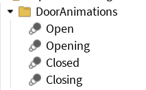
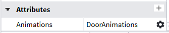

# Door System
A simple door system using state and animations to open and close doors

## Setting Up
1. Download a `.rbxm` file from the latest release in the "Releases" page
2. Drag-n-drop the `.rbxm` file into Roblox Studio
3. A "DoorService" module script should appear in a DataModel as a child of `Workspace` instance
4. Put the module either inside the `ServerScriptService` or `ReplicatedStorage`
5. To make the system work, simply `require()` the "DoorService" module inside a **server** script

After that, you can tag any model with a `Door` tag that you want to work like doors.

For the door to work, you need animations made for it. For the door to load animations properly, you need 4 animations instances that must be in a container:



Then, you need to create an `Animations` attribute with an `Instance` as a type, and simply set the attribute to the container.



## Configuration
A door instance can be configured with attributes
- `Animations`: *Instance* – the animations a door must use.

## Remarks
For door interaction, you will have to write a code that will invoke the `Door:Toggle()` method. The rest of the logic will be on the module.

A very short and simple example:
```luau
const DoorService = require(game.ServerScriptService.DoorService)
const door = DoorService:GetDoorByModel(workspace.Door)
if not door then return warn("No door found") end
door:Toggle()
```